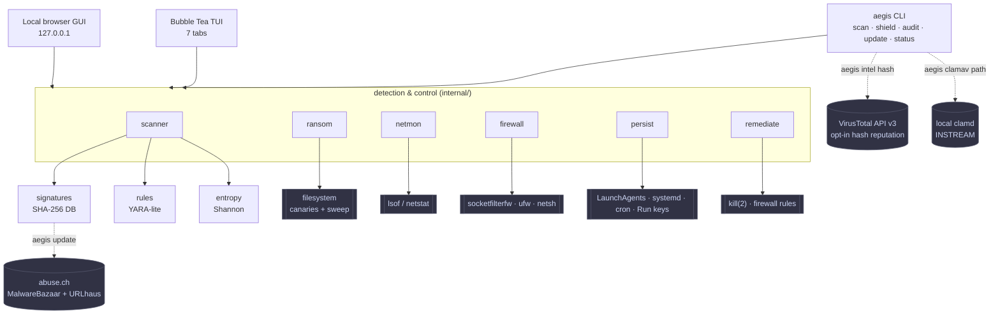
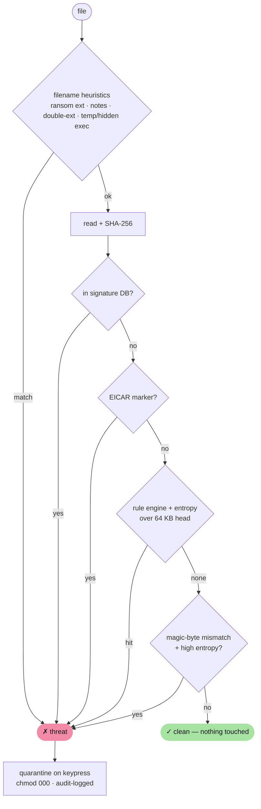
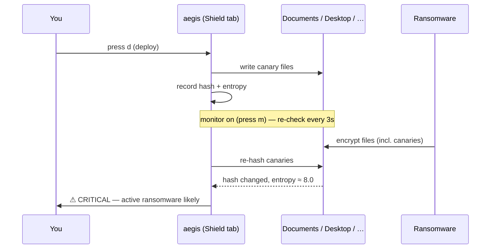

# aegis

[](https://github.com/andreipaciurca/aegis/actions/workflows/ci.yml)
[](https://github.com/andreipaciurca/aegis/actions/workflows/release.yml)
[](https://andreipaciurca.github.io/aegis/)
[](go.mod)
[](https://github.com/andreipaciurca/aegis/releases)
[](LICENSE)
[](https://github.com/andreipaciurca/aegis)

A fast, minimal internet-security app for the terminal and browser: **malware &
ransomware detection**, **firewall control**, **network monitoring** and a
**persistence audit** in one static binary. No daemons, no kernel extensions, no
background services — it runs when you run it and uses your OS's own security
machinery.

**AEGIS** stands for **Adaptive Endpoint Guard for Internet Safety**: adaptive
because it combines signatures, rules, heuristics, canaries, OS checkups and
optional local AI; endpoint guard because it protects the machine in front of
you without pretending to be a cloud EDR.

**Official site:** https://andreipaciurca.github.io/aegis/

**Source:** https://github.com/andreipaciurca/aegis

**Trust & verification:** https://andreipaciurca.github.io/aegis/trust.html

## Table of Contents

- [Features](#features)
- [Architecture](#architecture)
  - [How a scan works](#how-a-scan-works--cheapest-checks-first)
  - [Ransomware shield](#ransomware-shield--canary-tripwires)
- [Install](#install)
  - [Release installer](#release-installer)
  - [From source](#from-source)
- [Use](#use)
  - [Keys](#keys)
- [Staying up to date](#staying-up-to-date)
- [Free and free-to-use detection sources](#free-and-free-to-use-detection-sources)
- [Publishing a release](#publishing-a-release)
- [Trust, signing and antivirus false positives](#trust-signing-and-antivirus-false-positives)
- [Design notes](#design-notes)
- [Contributing](#contributing)
- [Honest limitations](#honest-limitations)
- [Optional AI analyst](#optional-ai-analyst)
  - [Useful companion, not magic self-learning](#useful-companion-not-magic-self-learning)
  - [Updating llama.cpp and models](#updating-llamacpp-and-models)
  - [Online vulnerability context](#online-vulnerability-context)
  - [OSINT and external reputation](#osint-and-external-reputation)
  - [Storage and performance roadmap](#storage-and-performance-roadmap)
- [License](#license)

```
 AEGIS    1 Dashboard   2 Scanner   3 Shield   4 Network   5 Firewall   6 Audit   7 AI
────────────────────────────────────────────────────────────────────────────────────────

  ╭──────────────────────╮  ╭──────────────────────╮  ╭──────────────────────╮
  │ FIREWALL             │  │ MALWARE SCAN         │  │ RANSOM SHIELD        │
  │ ● ACTIVE             │  │ ● CLEAN              │  │ ● MONITORING         │
  │ macOS Application FW │  │ 48210 files · 32s    │  │ 8 canaries armed     │
  ╰──────────────────────╯  ╰──────────────────────╯  ╰──────────────────────╯

  ╭──────────────────────╮  ╭──────────────────────╮  ╭──────────────────────╮
  │ NETWORK              │  │ PERSISTENCE          │  │ SIGNATURES           │
  │ 0 flagged            │  │ 15 entries           │  │ 664 hashes           │
  │ 85 connections       │  │ nothing suspicious   │  │ 10 rules · fresh     │
  ╰──────────────────────╯  ╰──────────────────────╯  ╰──────────────────────╯

  ╭──────────────────────╮  ╭──────────────────────╮  ╭──────────────────────╮
  │ LOCAL AI             │  │ CHECKUP              │  │ TRUST                │
  │ ● READY              │  │ OS + deps            │  │ signed releases      │
  │ llama.cpp server     │  │ aegis checkup        │  │ make checksums       │
  ╰──────────────────────╯  ╰──────────────────────╯  ╰──────────────────────╯

Seven layers, one binary: native firewall, hash/rule/entropy scanning, ransomware
canaries, connection monitor, persistence audit, OS/dependency checkups, and a
local llama.cpp analyst.
```

## Features

- **Malware scanner** — parallel SHA-256 hashing against a local signature
  database, an updatable **YARA-lite rule engine** (reverse shells, Mimikatz,
  PowerShell download-cradles, webshells, coinminers, packed binaries…), and
  **entropy analysis**. Plus signature-free heuristics: double-extension
  masquerades (`invoice.pdf.exe`), temp-dir and hidden executables, and the
  EICAR test string so you can safely verify it works.
- **Ransomware shield** — deploys harmless **canary (honeypot) files** and
  watches them for tampering; if ransomware encrypts one, aegis knows within
  seconds. A directory sweep also catches ransom notes, known encrypted-file
  extensions (`.locked`, `.lockbit`, `.wncry`, …), and **magic-byte mismatch**
  (a `.jpg` whose bytes aren't a JPEG and whose entropy is high = encrypted).
  Optional real-time monitor re-checks every 3 seconds.
- **Persistence audit** — enumerates the autostart mechanisms malware abuses
  to survive reboot: macOS LaunchAgents/LaunchDaemons, Linux systemd/cron/
  autostart, and on Windows, registry Run/RunOnce keys, Scheduled Tasks
  (filtered to non-Microsoft tasks — the OS ships hundreds of signed,
  low-signal ones) and auto-start Services. Flags suspicious entries
  (temp-dir payloads, encoded commands, download-and-run, and Windows
  LOLBin patterns like `regsvr32 /i:`, `mshta`, `certutil -urlcache`), each
  with the exact command to disable it.
- **Actionable remediation** — every finding suggests a fix: **kill a
  process** (with a confirm prompt), **block a port** at the native firewall,
  or **disable an autostart** entry — with the precise command shown.
- **One-key quarantine, with an undo** — threats are moved to a locked-down
  quarantine directory (`chmod 000`) with a JSON audit log; originals are
  never silently deleted. `aegis history` lists everything ever quarantined;
  `aegis restore <id>` (or `v` in the TUI Scanner tab, or the GUI's History
  panel) moves a file back if it turns out to be a false positive. Restore
  refuses to run twice on the same record and refuses to overwrite a file
  that already exists at the original path.
- **Maintenance updates** — press `u` in the TUI/paired app, click **Update &
  Check Versions** in the GUI, or run `aegis update` from a script (add
  `--json` for machine-readable output). All three refresh signatures *and*
  check for newer Aegis and llama.cpp releases; none of them self-replace the
  binary. Signatures come from multiple abuse.ch sources: high-confidence
  [MalwareBazaar](https://bazaar.abuse.ch/) sample hashes and medium-confidence
  [URLhaus](https://urlhaus.abuse.ch/) collected payload hashes. Aegis stores
  source provenance per hash; URLhaus-only matches are reported as review
  warnings because collected payloads are not always malicious. Rules live in
  `<config>/rules.json` and merge with the built-ins, so you can add detections
  without recompiling — see [docs/rules.md](docs/rules.md) for the schema and
  worked examples. Everything works offline once fetched.
- **Optional OSINT enrichment** — `aegis intel <hash>` performs an explicit
  VirusTotal file reputation lookup for an MD5, SHA-1 or SHA-256. Normal scans
  never call VirusTotal and never upload files; the command sends only the hash
  you provide, using your `VT_API_KEY`.
- **Optional ClamAV bridge** — `aegis clamav PATH` streams files to a local
  `clamd` daemon over ClamAV's `INSTREAM` protocol. This gives users a free,
  self-hosted AV engine without bundling ClamAV code or redistributing ClamAV
  signature databases inside aegis.
- **Startup maintenance** — when the TUI, GUI or paired app starts, aegis
  refreshes the malware-hash database, checks whether a newer aegis release is
  published, and checks the latest llama.cpp release. It just reports what it
  finds; nothing gets replaced automatically.
- **Firewall panel** — reads and toggles the *native* OS firewall rather
  than reinventing one: macOS Application Firewall (+ pf status, stealth
  mode), Linux ufw/nftables/iptables, Windows Defender Firewall. If aegis
  lacks privileges it tells you the exact `sudo` command instead of failing.
- **Network monitor** — live table of open connections and listeners,
  auto-refreshing, with suspicious entries flagged first (classic backdoor
  ports, plaintext telnet, listeners bound to all interfaces).
- **Scriptable** — `scan`/`shield`/`audit`/`update`/`status` subcommands run
  headless with meaningful exit codes, ready for cron or CI.
- **Browser GUI** — `aegis gui` starts a local-only web interface on
  `127.0.0.1` for people who'd rather skip the terminal. A
  single dashboard view leads with the protection score and summary cards;
  Scanner, Shield, Network, **Firewall**, Audit, Checkup, AI and Quarantine
  History are each their own tab, matching the TUI one panel at a time
  instead of stacking everything into one long scroll. Every API call is
  checked against the request's origin, so a webpage open in another tab
  can't silently drive it.
- **Paired mode** — `aegis app` launches the TUI and local browser GUI from one
  process so both surfaces talk to the same scanner, signature database, rules
  engine and checkup/AI setup code.
- **Local API over a Unix socket** — `aegis gui --socket PATH` (also works with
  `aegis app`) additionally serves the same API on a Unix domain socket,
  owner-only permissions, no TCP port, no browser tab — groundwork for a thin
  native app shell (SwiftUI, GTK, …) to drive the existing Go core instead of
  reimplementing detection logic per platform. Works on macOS and Linux, and
  on Windows 10 1809+ / Server 2019+ where Go's `"unix"` network is backed by
  native AF_UNIX; older Windows falls back to TCP only rather than failing.
- **AI analyst** — privacy-first llama.cpp by default, plus an opt-in
  OpenAI-compatible backend for users who explicitly configure an API key. It
  explains findings, remembers approved local context and triages false
  positives without changing deterministic detections.

## Architecture

aegis adds no machinery of its own. The TUI, browser GUI and CLI share one core;
each subsystem is a thin, fast layer over a primitive the OS already ships — so
the footprint stays tiny and nothing is left running when you quit.



### How a scan works — cheapest checks first

Each file runs a short-circuiting pipeline. The fast, free checks reject or
clear most files before aegis ever reads the whole thing to hash it. This
mirrors `scanFile` in [internal/scanner/scanner.go](internal/scanner/scanner.go).



### Ransomware shield — canary tripwires

Canaries are harmless decoy files. aegis records each one's hash, then polls
them (or checks on demand). If ransomware encrypts a canary, its hash changes
and its entropy spikes toward the 8.0 ceiling — caught within seconds, no
kernel driver required. See [internal/ransom/ransom.go](internal/ransom/ransom.go).



## Install

### Release installer

macOS / Linux:

```sh
curl -fsSL https://raw.githubusercontent.com/andreipaciurca/aegis/main/scripts/install.sh | sh
aegis version
```

User-local install, useful when you do not want `sudo`:

```sh
curl -fsSL https://raw.githubusercontent.com/andreipaciurca/aegis/main/scripts/install.sh | sh -s -- --user
```

Windows PowerShell:

```powershell
iwr https://raw.githubusercontent.com/andreipaciurca/aegis/main/scripts/install.ps1 -UseB | iex
aegis version
```

System-wide Windows install:

```powershell
$p="$env:TEMP\aegis-install.ps1"
iwr https://raw.githubusercontent.com/andreipaciurca/aegis/main/scripts/install.ps1 -OutFile $p
powershell -ExecutionPolicy Bypass -File $p -System
```

The installers are also updaters. If `aegis` is already on PATH and you do not
pass a target directory, they update that existing binary. Otherwise they
download the latest release archive from GitHub, verify it against `SHA256SUMS`,
install `aegis`/`aegis.exe`, and add the install directory to PATH where
appropriate.

### From source

Requires Go 1.21+ (the toolchain auto-fetches what it needs).

```sh
git clone https://github.com/andreipaciurca/aegis
cd aegis
make build        # → ./aegis
make install      # → $GOPATH/bin/aegis
sudo make install-system  # → /usr/local/bin/aegis
make release      # → dist/ binaries for macOS, Linux, Windows (amd64+arm64)
```

## Use

```sh
aegis                     # launch the TUI
aegis gui                 # launch the local browser GUI
aegis app                 # launch both together
aegis scan ~/Downloads    # headless scan (hashes + rules + entropy); exit 1 if threats
aegis shield              # ransomware sweep: canaries, notes, encrypted files
aegis audit               # list autostart entries, flag suspicious ones
aegis update              # refresh signatures + check for aegis/llama.cpp updates
aegis status              # one-shot summary of every subsystem
aegis intel <sha256>      # optional VirusTotal reputation lookup
aegis clamav ~/Downloads  # optional local ClamAV daemon scan
aegis history             # list everything ever quarantined
aegis restore <id>        # undo a quarantine (false positive? this reverses it)
```

ClamAV bridge:

```sh
# Start clamd yourself, then let aegis stream files to it.
aegis clamav ~/Downloads
aegis clamav ~/Downloads --addr tcp://127.0.0.1:3310 --json
```

### Keys

| Key | Action |
|-----|--------|
| `1`–`7` / `tab` | switch tabs (Dashboard · Scanner · Shield · Network · Firewall · Audit · AI) |
| `u` | update signatures (any tab) |
| `s` / `e` / `c` · `↑↓` + `x` | scan · edit path · cancel · select + quarantine (Scanner) |
| `v` (in Scanner) | view quarantine history · `↑↓` select · `x` restore |
| `d` / `c` / `s` / `m` | deploy canaries · clear · sweep now · real-time monitor (Shield) |
| `↑↓` + `k` / `b` | select · kill process · block port (Network) |
| `e` / `d` / `t` | enable · disable · stealth mode (Firewall) |
| `↑↓` + `x` | select · show disable command (Audit) |
| `a` / `x` / `n` / `t` | ask · explain selected scan threat · remember context · test model (AI) |
| `r` | refresh · `q` quit |

## Staying up to date

- **Startup:** `aegis`, `aegis gui` and `aegis app` automatically refresh the
  malware signature DB and check for newer aegis/llama.cpp releases in the
  background. The app opens immediately and reports the result in the status
  area. These automatic checks are throttled to once every 30 minutes
  (`AEGIS_STARTUP_CHECK_INTERVAL`, a Go duration like `10m` or `1h`; `0`
  disables throttling) so relaunching aegis repeatedly — a dev loop, a busy
  shell — doesn't refetch signatures and poll two GitHub endpoints on every
  single launch. The signature *count* shown is always read live even when
  the network checks are skipped, so it's never stale-looking.
- **Manual update:** press `u` in the TUI/paired app, use the GUI
  **Update & Check Versions** button, or run `aegis update` (add `--json` for
  scripts) — all three do the same thing: refresh signatures and check
  whether a newer aegis or llama.cpp release is available. Unlike the
  automatic startup check, these are never throttled — they're always live.
  For automation: `crontab -e` → `0 9 * * * /usr/local/bin/aegis update`.
- **The app:** it's one static binary, and aegis never silently replaces it.
  `aegis update` (or the checks above) will tell you a newer release exists
  and print its URL — then `git pull && make install`, re-run the
  [install script](#release-installer) (which doubles as an updater), or drop
  a new release binary in place.
- **llama.cpp:** startup checks report the latest matching llama.cpp release.
  Run `aegis ai setup --download-llama` when you want aegis to download and
  verify the selected asset.

## Free and free-to-use detection sources

Aegis prefers sources that are free to access, legally usable in an open-source
defensive tool, and safe for user privacy.

| Source | Used by aegis | Why |
|--------|---------------|-----|
| abuse.ch MalwareBazaar and URLhaus | `aegis update` | Public hash feeds with clear defensive value. MalwareBazaar hashes are high confidence; URLhaus payload hashes are useful but treated as review warnings. |
| ClamAV | `aegis clamav PATH` | Open-source, self-hosted AV engine. Files stay on your machine when you run a local `clamd`; aegis streams bytes with `INSTREAM` and does not bundle ClamAV or its databases. |
| CISA KEV and NVD | `aegis checkup` | Public vulnerability context for OS/dependency posture and recent exploited CVEs. |
| VirusTotal | `aegis intel HASH` only | Good for analyst enrichment, but not automatic scanning. The free API is not a general commercial scanning source and file submissions have privacy implications. |
| VirusSign free feeds | manual research only | The free tier requires a community account and is limited to about 100 records/day; some downloads are malware samples, so aegis does not fetch them automatically. |

The Stack Overflow advice that aged well is still the right shape: there is no
single complete, free, static list of “all virus signatures.” Static signatures
must be combined with heuristics, entropy checks, canaries, OS posture checks
and, when the user chooses, a self-hosted engine such as ClamAV.

## Publishing a release

Releases are automated by GitHub Actions. The easiest path is GitHub Actions →
`Release` → `Run workflow` → choose `patch`, `minor` or `major`. The workflow
computes the next tag, creates it, builds macOS, Linux and Windows archives,
generates `SHA256SUMS`, verifies the checksums and publishes a GitHub Release.

You can also publish an exact tag from the terminal:

```sh
git checkout main
git pull
git tag -a v1.3.0 -m "aegis v1.3.0"
git push origin v1.3.0
```

The release will contain `.tar.gz` archives for macOS/Linux, a `.zip` for
Windows, and `SHA256SUMS`. See
[docs/RELEASE_SIGNING.md](docs/RELEASE_SIGNING.md) for signing and
false-positive submission details.

## Trust, signing and antivirus false positives

Security tools often trigger antivirus heuristics because they contain detection
strings, malware-family names, quarantine logic, process termination code and
firewall commands. For release hygiene, aegis includes:

- [SECURITY.md](SECURITY.md) for vulnerability and false-positive reporting.
- [docs/RELEASE_SIGNING.md](docs/RELEASE_SIGNING.md) for checksums, GPG
  signatures, macOS signing/notarization and Windows Authenticode guidance.
- `make checksums` to write `dist/SHA256SUMS`.
- `make sign-checksums` for detached GPG signatures.
- `make sign-darwin` and `make sign-windows` scaffolding, gated by local
  signing identity environment variables.
- [docs/trust.html](docs/trust.html) for user-facing verification guidance.

Release flow:

```sh
make clean
make release
make checksums
GPG_KEY="KEYID_OR_EMAIL" make sign-checksums
```

Official project URLs for vendor submissions:

- Website: https://andreipaciurca.github.io/aegis/
- Source: https://github.com/andreipaciurca/aegis
- Trust page: https://andreipaciurca.github.io/aegis/trust.html

Avoid packing release binaries with UPX or similar compressors. Packed security
tools look much more suspicious to heuristic scanners.

## Design notes

- **Footprint:** single ~10 MB binary, ~13 MB RSS, zero background processes.
  Scanning uses up to 8 hashing workers and reads only a 64 KB head per file
  for rule/entropy analysis; it skips files over 200 MB and noisy directories
  (caches, `node_modules`, `.git`). Ransomware canaries are polled, not
  watched with a kernel inotify tree, so protection stays nearly free.
  On low-power systems, set `AEGIS_SCAN_WORKERS=1` (or another value up to 8)
  to trade scan speed for lower CPU, memory and I/O pressure. Startup checks
  are cached too (`AEGIS_STARTUP_CHECK_INTERVAL`), so repeat launches cost
  nothing.
- **Reliability:** the scanner treats unreadable files as skips, never fatal;
  firewall, network and audit views degrade gracefully without root. Killing a
  process asks for confirmation first, because it can't be undone, and refuses
  to touch PID ≤ 1 or aegis itself; quarantine doesn't need that gate because
  it's reversible (`aegis restore`). Unit tests cover the rule engine, the
  canary tamper detection, the quarantine/restore round trip, and the
  persistence heuristics.
- **Platforms:** macOS first (Application Firewall + pf + lsof + LaunchAgents),
  then Linux (ufw/nftables/iptables + lsof + systemd/cron), then Windows
  (netsh + netstat + registry Run keys, Scheduled Tasks and auto-start
  Services).
- Built with [Bubble Tea](https://github.com/charmbracelet/bubbletea) and
  [Lip Gloss](https://github.com/charmbracelet/lipgloss); Catppuccin Mocha
  palette.

## Contributing

See [CONTRIBUTING.md](CONTRIBUTING.md) for dev setup, the `go vet && go test
-race && gofmt -l .` check CI runs on every PR, and how to add a detection
rule or a new persistence/checkup signal. Stick to the design constraints
([no daemons, privacy-first opt-in](CONTRIBUTING.md#design-constraints-that-prs-should-respect))
— they're what let aegis run with elevated capabilities and still be
trustworthy.

## Honest limitations

aegis is a capable lightweight tool, but it is **not** a drop-in
replacement for Bitdefender or Kaspersky — those run kernel drivers, cloud ML
and paid threat-research teams. Keep Gatekeeper/XProtect or Defender enabled
alongside it. Signature matching catches *known* samples; the rule engine,
entropy and heuristics catch common patterns and packing; the canaries catch
ransomware *as it acts* rather than before. aegis does not hook the kernel,
intercept traffic, or do on-access scanning — by design, to stay fast and
dependency-free.

Test it safely with the [EICAR file](https://www.eicar.org/download-anti-malware-testfile/):

```sh
printf 'X5O!P%%@AP[4\\PZX54(P^)7CC)7}$EICAR-STANDARD-ANTIVIRUS-TEST-FILE!$H+H*' > /tmp/eicar.txt
aegis scan /tmp
```

## Optional AI analyst

aegis can use a local GGUF model through **llama.cpp** for advisory security
analysis. Local remains the default because it keeps findings and host context
on the machine. Remote API models are also supported through an explicit
OpenAI-compatible backend when a user chooses convenience or stronger reasoning.
Neither mode replaces signatures, rules, entropy checks or canary alerts; the
model explains findings, estimates false-positive likelihood and suggests safe
next steps.

Start with the setup plan:

```sh
# Prints install paths, current llama.cpp release info and recommended commands.
aegis ai setup

# Optional: download and extract the latest matching llama.cpp release asset.
# The asset is selected at runtime for macOS/Linux/Windows and its sha256 digest
# is verified when GitHub publishes one.
aegis ai setup --download-llama
```

Two llama.cpp modes are supported:

- **Server mode** — run `llama-server` and let aegis call its local
  OpenAI-compatible endpoint.
- **CLI mode** — let aegis call `llama-cli` with a local `.gguf` model file.

```sh
# Option A: llama-server, recommended for chat and repeated triage
llama-server -m ~/.config/aegis/models/gemma.gguf --host 127.0.0.1 --port 8080
aegis ai config --backend llamacpp-server --endpoint http://127.0.0.1:8080/v1/chat/completions

# Option B: direct subprocess
aegis ai config --backend llamacpp-cli --model ~/.config/aegis/models/gemma.gguf --command llama-cli

# Option C: explicit remote API, useful when the user accepts cloud processing.
# The OpenAI-compatible model is configurable.
export OPENAI_API_KEY=...
aegis ai config --backend openai-compatible \
  --endpoint https://api.openai.com/v1/chat/completions \
  --remote-model gpt-5-mini \
  --api-key-env OPENAI_API_KEY

# Check readiness, ask a test question, or chat locally
aegis ai status
aegis ai test "Explain a packed executable finding"
aegis ai chat
aegis ai remember "Port 5000 is expected on my local dev machine"
aegis ai context

# Ask the model to triage scan findings
aegis scan ~/Downloads --ai
```

Hosted models can be connected today if they are exposed through an
OpenAI-compatible gateway. Native provider-specific or MCP adapters are feasible
but should be implemented as separate backends with explicit permissions,
provider-specific request formats and clear warnings before any host context is
sent outside the machine.

By default aegis sends **metadata only**: path, size, SHA-256, severity and
detection reason. If you want better false-positive analysis for scripts or
plain-text files, opt into tiny printable excerpts:

```sh
aegis ai config --privacy excerpt --max-excerpt 2048
```

The model is intentionally advisory. It cannot mark a signature match clean,
cannot auto-delete files and cannot override canary tamper alerts. Treat it
like a local junior analyst: useful for explanation and prioritization, not
as the authority of record.

### Useful companion, not magic self-learning

A chat or small “security companion” view is feasible because the AI layer now
has a clean backend. The useful version would summarize system checkups, explain
new CISA KEV/NVD items, remember local preferences and remind you when posture
changes. The safe version should **not retrain itself** on private files or
silently change detections. Instead, aegis can keep a local context file with
approved notes such as “this lab VM intentionally exposes port 5000” or “this
repo has benign Mimikatz strings in tests,” then include those notes in prompts.
Use `aegis ai remember ...` to add a note and `aegis ai context` to inspect
what will be included.

New vulnerabilities are best handled as **retrieval/context**, not model
training: `aegis checkup` already fetches CISA KEV and NVD data, and the local
model can explain those entries against your OS, package managers and audit
results.

### Updating llama.cpp and models

aegis does not bundle llama.cpp or model weights. That keeps the binary small,
auditable and license-clean. Update the runtime the same way you installed it:

```sh
# Homebrew
brew upgrade llama.cpp

# Source build
git -C ~/src/llama.cpp pull
cmake --build ~/src/llama.cpp/build --config Release
```

Model files are separate `.gguf` artifacts. For most laptops, start with a
small instruction-tuned Gemma GGUF in the 2B-4B range with Q4_K_M quantization,
then move up only if latency and memory are still comfortable. Download or
replace the model yourself, then point aegis at the new path with
`aegis ai config --model /path/model.gguf`. Pin checksums for any model you
depend on operationally.

### Online vulnerability context

`aegis checkup` pulls that vulnerability context from CISA KEV and NVD when
online, and runs `--offline` when you'd rather skip the network call. Fetch
from named, source-attributed feeds, cache the summaries locally, then let
the model comment on what's there — that's the safer pattern for "latest
zero-day" awareness. Never let a model browse arbitrary pages on its own and
rewrite detections from what it finds.

### OSINT and external reputation

VirusTotal support is intentionally opt-in because external reputation services
receive the indicator you ask about. Configure an API key and query a hash:

```sh
export VT_API_KEY=...
aegis intel 275a021bbfb6489e54d471899f7db9d1663fc695ec2fe2a2c4538aabf651fd0f
aegis intel <sha256> --json
```

Aegis uses the VirusTotal API v3 file-report endpoint and sends only the hash,
never the file contents. Use this to enrich a detection or investigate a false
positive; keep offline scanning and local signatures as the source of truth for
day-to-day operation.

Other security-world standards worth integrating next are **STIX/TAXII** for
structured threat-intelligence exchange and **MISP** for team/community IOC
sharing. Those should be connector-style features with explicit credentials,
caching and clear privacy labels, not hidden dependencies in the scanner hot
path.

### Storage and performance roadmap

SQLite would be useful for durable state, not for the hot scanner loop. The best
use is a local `aegis.db` for scan history, quarantine records, checkup results,
vulnerability-feed cache, model context notes and “known benign for this host”
decisions. The scanner itself should remain streaming and parallel: file walks,
hashing, entropy sampling and rule checks are I/O-bound, so inserting every file
into SQLite during a scan would usually make it slower.

For maximum speed and low resource use, aegis should keep:

- streaming scans with bounded worker pools
- mmap or chunked reads only where it beats plain reads on the target OS
- incremental signature/rule updates
- cached checkup/vulnerability data with TTLs
- optional AI calls only for selected findings or user prompts
- SQLite writes batched after scans, not inside the per-file hot path

## License

aegis is open source under [GPL-3.0-or-later](LICENSE). In practical terms:
use it, study it, modify it, publish it, and build on it, as long as
redistributed copies and modified versions remain open source under the same
license terms and keep attribution. See [NOTICE](NOTICE) for project credit and
inspiration notes.
