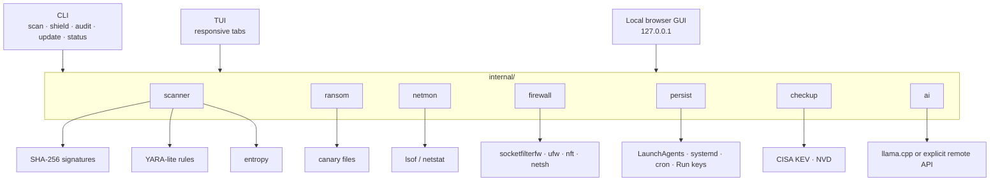
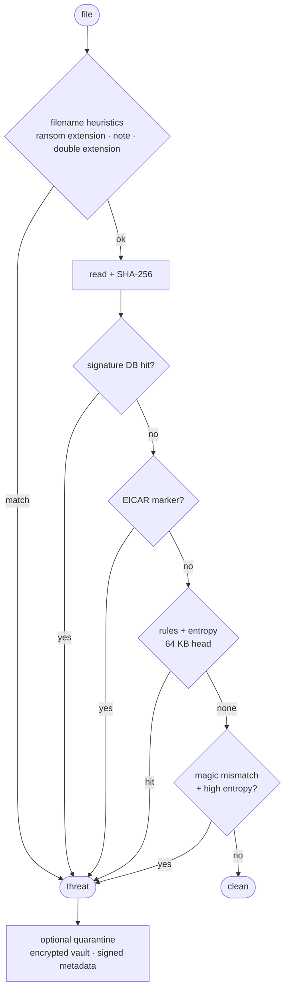
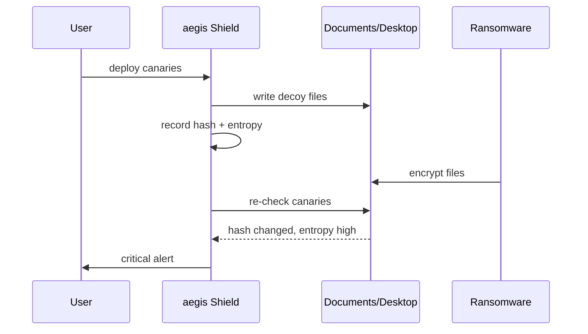

# aegis User Guide

This is the detailed manual for users who want the diagrams, commands, options,
setup paths and tradeoffs behind aegis.

## Table of Contents

- [Architecture](#architecture)
- [Scan Pipeline](#scan-pipeline)
- [Ransomware Shield](#ransomware-shield)
- [Install and Update](#install-and-update)
- [Command Reference](#command-reference)
- [TUI Keys](#tui-keys)
- [Detection Sources](#detection-sources)
- [Quarantine and Restore](#quarantine-and-restore)
- [AI Analyst](#ai-analyst)
- [Online Reputation and OSINT](#online-reputation-and-osint)
- [Trust and False Positives](#trust-and-false-positives)
- [Release Publishing](#release-publishing)
- [Performance Notes](#performance-notes)
- [Limitations](#limitations)

## Architecture

aegis keeps the TUI, GUI and CLI thin. They all call the same Go core, so a
scan result, quarantine action or checkup means the same thing regardless of
surface.



The design goal is a useful security cockpit, not an always-on endpoint agent.
No background service remains after aegis exits.

## Scan Pipeline

The scanner runs cheap checks before expensive checks.



Important defaults:

- files over 200 MiB are skipped
- noisy directories such as `.git`, `node_modules` and caches are skipped
- unreadable files are counted as skipped, not fatal
- scans use a bounded worker pool, capped at 8 workers

Set `AEGIS_SCAN_WORKERS=1` on low-power systems to reduce CPU and I/O pressure.

## Ransomware Shield

The shield has two jobs:

- deploy harmless canary files and detect tampering
- sweep common user folders for ransom notes, encrypted extensions and
  high-entropy files whose bytes do not match their extension



The monitor polls instead of installing a kernel watcher. That keeps it simple,
portable and cheap.

## Install and Update

macOS/Linux:

```sh
curl -fsSL https://raw.githubusercontent.com/andreipaciurca/aegis/main/scripts/install.sh | sh
```

macOS/Linux user-local:

```sh
curl -fsSL https://raw.githubusercontent.com/andreipaciurca/aegis/main/scripts/install.sh | sh -s -- --user
```

Windows PowerShell:

```powershell
iwr https://raw.githubusercontent.com/andreipaciurca/aegis/main/scripts/install.ps1 -UseB | iex
```

Windows cmd.exe fallback:

```cmd
powershell -ExecutionPolicy Bypass -Command "iwr https://raw.githubusercontent.com/andreipaciurca/aegis/main/scripts/install.ps1 -UseB | iex"
```

The installers are idempotent. If aegis is already on PATH and no explicit
target directory is passed, they update the existing binary.

Manual update checks:

```sh
aegis update
aegis update --json
```

Startup checks:

- TUI, GUI and paired app refresh signatures in the background
- they check for newer aegis and llama.cpp releases
- they do not silently replace the running binary
- repeated startup checks are throttled by `AEGIS_STARTUP_CHECK_INTERVAL`

## Command Reference

Core commands:

```sh
aegis                     # launch the TUI
aegis gui                 # local browser GUI
aegis app                 # TUI + GUI paired together
aegis status              # one-shot posture summary
aegis update              # signatures + version checks
aegis version             # installed version
```

Detection:

```sh
aegis scan PATH           # malware/ransomware scan
aegis scan PATH --json
aegis scan PATH --ai      # ask configured AI to triage findings
aegis shield              # ransomware sweep
aegis audit               # persistence/autostart audit
aegis network             # connections and risky listeners
aegis firewall            # native firewall status/helpers
aegis checkup             # OS/dependency/security-feed check
aegis checkup --offline
```

Quarantine:

```sh
aegis history
aegis history --json
aegis restore <stored-path-or-sha256>
aegis restore <stored-path-or-sha256> --original
```

External enrichment:

```sh
aegis intel <md5-or-sha1-or-sha256>
aegis intel <hash> --json
aegis clamav PATH
aegis clamav PATH --addr tcp://127.0.0.1:3310 --json
```

AI:

```sh
aegis ai setup
aegis ai setup --json
aegis ai setup --download-llama
aegis ai status
aegis ai test "Explain this finding"
aegis ai chat
aegis ai remember "Port 5000 is expected on this dev machine"
aegis ai context
```

## TUI Keys

| Key | Action |
|-----|--------|
| `1`-`7` / `tab` | switch tabs |
| `u` | update signatures and check versions |
| `s` | start scan in Scanner |
| `e` / `p` | edit scan path |
| `c` | cancel scan |
| `up/down` + `x` | select and quarantine a scan finding |
| `v` | view quarantine history |
| `x` in history | restore to review folder |
| `d` / `c` / `s` / `m` | deploy, clear, sweep and monitor canaries |
| `k` / `b` | kill selected process or block selected port |
| `e` / `d` / `t` | enable, disable or toggle firewall stealth mode |
| `a` / `x` / `n` / `t` | AI ask, explain, remember note, test model |
| `r` | refresh current view |
| `q` | quit |

## Detection Sources

aegis uses free and free-to-use sources where possible:

| Source | Used by | Notes |
|--------|---------|-------|
| abuse.ch MalwareBazaar | `aegis update` | high-confidence malware hashes |
| abuse.ch URLhaus | `aegis update` | payload hashes, treated as review warnings |
| CISA KEV | `aegis checkup` | known exploited vulnerabilities |
| NVD | `aegis checkup` | CVE context |
| ClamAV | `aegis clamav` | optional local self-hosted AV engine |
| VirusTotal | `aegis intel` | opt-in hash lookup only |

There is no complete free list of every malware signature. Static signatures
need heuristics, entropy, canaries, OS posture checks and optional external
reputation.

## Quarantine and Restore

New quarantines are encrypted vaults:

- stored as `.aqv`
- encrypted with AES-GCM
- content-addressed by SHA-256
- protected by HMAC-signed metadata
- written atomically before the original is removed

Default restore is intentionally cautious:

```sh
aegis restore <id>
```

That decrypts the file into Aegis's safe review folder and marks the record as
restored. To restore to the original path, opt in explicitly:

```sh
aegis restore <id> --original
```

Restore verifies the record signature, vault signature and decrypted content
hash. It refuses double restore and refuses to overwrite existing files.

## AI Analyst

aegis can use local llama.cpp or an explicit OpenAI-compatible backend. The
model is advisory: it can explain findings and help triage false positives, but
it cannot mark a deterministic signature clean or override canary alerts.

Recommended local path:

```sh
aegis ai setup
aegis ai setup --download-llama
```

Server mode:

```sh
llama-server -hf lmstudio-community/gemma-4-E4B-it-GGUF:Q4_K_M --host 127.0.0.1 --port 8080
aegis ai config --backend llamacpp-server --endpoint http://127.0.0.1:8080/v1/chat/completions
```

Manual model folder, macOS:

```sh
export AEGIS_MODEL_DIR="$HOME/Library/Application Support/aegis/models"
mkdir -p "$AEGIS_MODEL_DIR"
```

Manual model folder, Linux/Unix:

```sh
export AEGIS_MODEL_DIR="${XDG_CONFIG_HOME:-$HOME/.config}/aegis/models"
mkdir -p "$AEGIS_MODEL_DIR"
```

Windows PowerShell:

```powershell
$env:AEGIS_MODEL_DIR = Join-Path $env:LOCALAPPDATA 'aegis\models'
New-Item -ItemType Directory -Force -Path $env:AEGIS_MODEL_DIR | Out-Null
```

Windows cmd.exe:

```cmd
set "AEGIS_MODEL_DIR=%LOCALAPPDATA%\aegis\models"
if not exist "%AEGIS_MODEL_DIR%" mkdir "%AEGIS_MODEL_DIR%"
```

CLI mode:

```sh
aegis ai config --backend llamacpp-cli --model "$AEGIS_MODEL_DIR/model.gguf" --command llama-cli
```

Remote OpenAI-compatible mode:

```sh
export OPENAI_API_KEY=...
aegis ai config --backend openai-compatible \
  --endpoint https://api.openai.com/v1/chat/completions \
  --remote-model gpt-5-mini \
  --api-key-env OPENAI_API_KEY
```

Recommended model family:

- Gemma 4 E4B instruct GGUF, Q4_K_M
- Gemma 3 4B instruct GGUF, Q4_K_M fallback
- Gemma 2B instruct GGUF for smaller machines

Review each model license before operational use.

## Online Reputation and OSINT

VirusTotal is explicit and hash-only:

```sh
export VT_API_KEY=...
aegis intel <sha256>
```

Normal scans never call VirusTotal and never upload files.

Future connector-style integrations that fit the project:

- STIX/TAXII feeds
- MISP communities
- provider-specific AI backends
- MCP tools for controlled analyst workflows

These should stay opt-in, credentialed and clearly labeled.

## Trust and False Positives

Security tools can trigger antivirus heuristics because they contain detection
strings, malware-family names, quarantine code, process termination helpers and
firewall commands.

Release hygiene includes:

- GitHub release archives for macOS, Linux and Windows
- `SHA256SUMS`
- signing docs in [RELEASE_SIGNING.md](RELEASE_SIGNING.md)
- false-positive reporting instructions in [../SECURITY.md](../SECURITY.md)
- public trust page at <https://andreipaciurca.github.io/aegis/trust.html>

Verify downloads:

```sh
shasum -a 256 -c SHA256SUMS
```

Avoid packing aegis binaries with UPX or similar compressors. Packed security
tools look much more suspicious to heuristic scanners.

## Release Publishing

Releases are automated by GitHub Actions.

Recommended path:

1. Merge changes into `main`.
2. Go to GitHub Actions.
3. Run the `Release` workflow.
4. Choose `patch`, `minor` or `major`, or provide an exact tag.

The workflow builds:

- macOS arm64 and amd64 archives
- Linux arm64 and amd64 archives
- Windows amd64 zip
- `SHA256SUMS`

Exact tag path:

```sh
git checkout main
git pull
git tag -a vX.Y.Z -m "aegis vX.Y.Z"
git push origin vX.Y.Z
```

## Performance Notes

The scanner is intentionally simple and bounded:

- parallel workers are capped at 8
- only the file head is used for rule and entropy checks
- huge files are skipped
- unreadable files are skipped
- startup maintenance is cached with `AEGIS_STARTUP_CHECK_INTERVAL`
- AI is called only when explicitly configured and requested

SQLite would be useful for durable state such as scan history, quarantine
records, checkup cache, AI context notes and known-benign decisions. It should
not sit in the per-file hot scan path.

## Limitations

aegis is not a drop-in replacement for Defender, XProtect, Gatekeeper,
Bitdefender, Kaspersky or an enterprise EDR.

It does not:

- hook the kernel
- inspect traffic inline
- perform on-access scanning
- upload unknown files for cloud ML
- silently train on private data
- guarantee detection of new malware families

Keep your OS protections enabled. Use aegis as a fast, inspectable layer for
local checks, remediation hints, offline-friendly signatures and operator
visibility.
